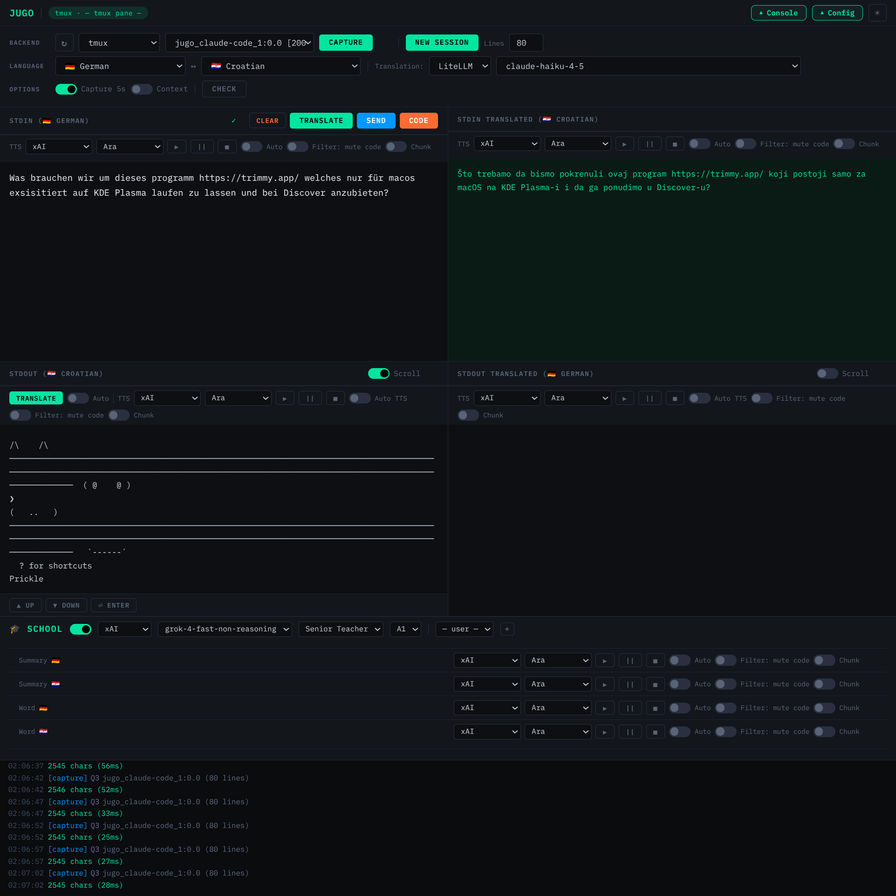

# JUGO

Language learning platform — immersive, multi-quadrant UI for real-time translation, TTS, and OpenAI-v1-assisted language practice.

## Versions

| Tag | Date | Description |
|-----|------|-------------|
| `2026.5.26` | 2026-05-15 | Session-scoped console & chat, remove DB persistence |
